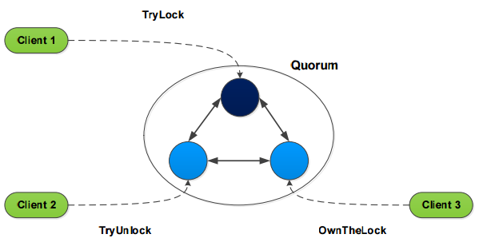
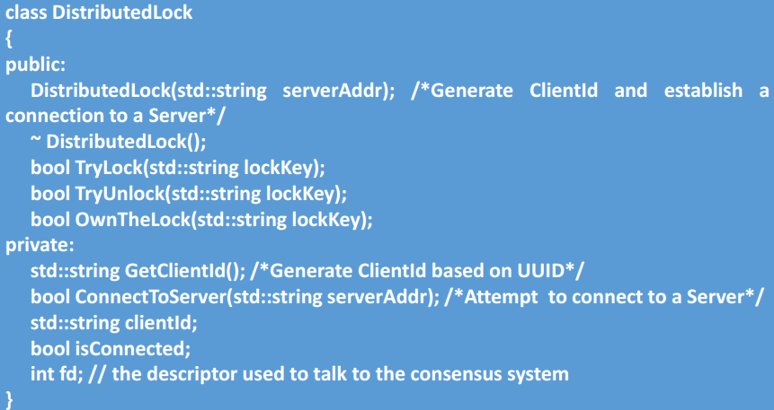

# Distributed Lock

A Python 3 distributed lock simulation, mainly rely on *threading* and *socket* modules. Class project 2 of [Big Data 
Processing Technologies](http://www.cs.sjtu.edu.cn/~wuct/bdpt/).

## Project Description

### Project 2: Distributed Lock Design

* Design a simple consensus system, which satisfy the following requirements
    * Contain one leader server and multiple follower server
    * Each follower server has a replicated map, the map is consisted with the leader server
    * The key of map is the name of distributed lock, and the value is the Client ID who owns the distributed lock
    


* Support multiple clients to preempt/release a distributed lock, and check the owner of a distributed lock
    * For preempting a distributed lock
        * If the lock doesn't exist, preempt success
        * Otherwise, preempt fail
    * For releasing a distributed lock
        * If the client owns the lock, release success
        * Otherwise, release fail
    * For checking a distributed lock
        * Any client can check the owner of a distributed lock
        
* To ensure the data consistency of the system, the follower servers send all preempt/release requests to the leader 
server
* To check the owner of a distributed lock, the follower server accesses its map directly and sends the results to the
 clients
* When the leader server handling preempt/release requests
    * If needed, modify its map and sends a request propose to all follower servers
    * When a follower server receives a request propose
        * modify its local map
        * check the request is pending or not
        * if the request is pending, send an answer to the client
* In this system, all clients provide preempt/release/check distributed lock interface
* When a client is initialized
    * Define the IP address of the target server
    * Generate the Client ID information based on the user information(UUID)
* References
* Data structure of a client in the consensus system



## Project Structure

### Core files

* client.py
    * defines the client class
* leader
    * defines the leader server class
* follower
    * defines the follower server class
* rw_lock
    * defines the readers-writer lock
* distributed_lock
    * defines the main function, **run this file** to see the simulation results, more detailed simulation results are stored in file ```DistributedLock_detail_<time_suffix>.log``` under directory ```log/```.

### Auxiliary files

* utils
    * defines some auxiliary functions
* const
    * defines some constants
* parameter
    * defines some variable parameters
